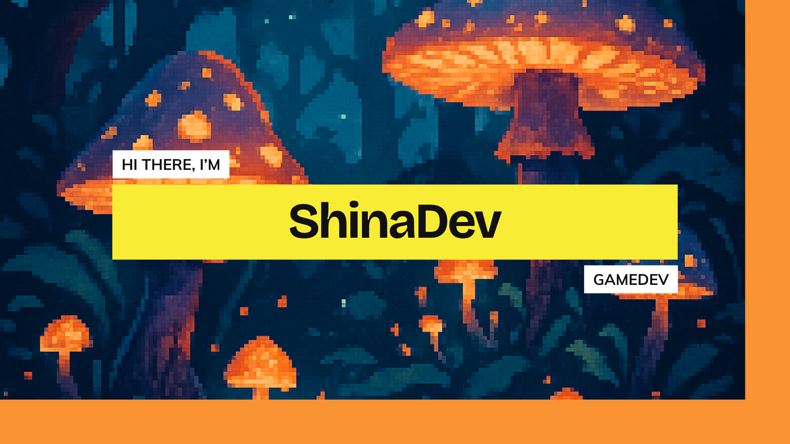

<div align="center">


  
# 👋 Hi, I'm Selene Contigiani

### Game Developer | Unity Programmer | Interactive Experience Designer

[](https://linkedin.com/in/selencontigiani)
[](mailto:selene.contigiani@example.com)
[](#)

</div>

---

## 🎮 About Me

I'm a **Video Game Development and Virtual Simulations** student, about to graduate, with a strong focus on **Unity programming** and creating meaningful player experiences.

```yaml
current_focus: "Thesis Project - 2D Mobile Game in Unity"
interests: ["Game Design", "Interactive Storytelling", "Player Experience", "Code Optimization"]
learning: ["Advanced Unity Patterns", "Mobile Game Development", "UI/UX for Games"]
goal: "Create games that blend creativity, technology, and engaging gameplay"
```

### What drives me

- 🎨 **Design & Creativity**: I believe great games balance mechanics with storytelling
- ⚡ **Optimization**: Writing clean, efficient code is a priority
- 🌱 **Continuous Learning**: Always exploring new techniques and industry trends
- 🎯 **Player-Centered**: Every decision I make considers the player experience

---

## 💻 Tech Stack

### Core Skills
<div align="center">


</div>

### Also Familiar With
<div align="center">


</div>

---

## 🚀 Projects

### 🏎️ Fast Try
> *In Development*

An endless runner mobile game where you drive a car on an infinite highway, shooting down enemies while collecting power-ups. Every few kilometers, a slot machine triggers, granting random upgrades and special abilities to your vehicle.

**Key Features**:
- Endless highway gameplay with dynamic difficulty
- Combat system with shooting mechanics
- Slot machine progression system for upgrades
- Power-up variety for strategic gameplay

**Tech**: Unity, C#, Mobile Development, Game Design

---

### 🏉 Rugby Club Promotional Game
> *Thesis Project - In Development*

A rugby-themed mobile game designed as a promotional tool for a local rugby club. Features multiple mini-games that capture the spirit and excitement of rugby, making it accessible and fun for all audiences.

**Key Features**:
- Collection of rugby-themed mini-games
- Mobile-optimized controls and UI
- Club branding integration
- Engaging gameplay for promotional purposes

**Tech**: Unity, C#, Mobile Development, Mini-game Design

---

> 📦 **More projects coming soon!** I'm currently focusing on completing my thesis and will be uploading repositories progressively.

---

## 📊 GitHub Stats

<div align="center">
  


</div>

---

## 📬 Let's Connect

I'm always open to discussing game development, collaborating on projects, or just chatting about interesting mechanics and design!

<div align="center">

📧 **Email**: selene.contigiani@example.com  
💼 **LinkedIn**: [linkedin.com/in/selencontigiani](https://linkedin.com/in/selencontigiani)  
📄 **CV**: Coming soon

</div>

---

<div align="center">
  
*"Great games are born from the intersection of creativity and code"*

⭐️ From [Shina-Dev](https://github.com/Shina-Dev) with 💜

</div>
