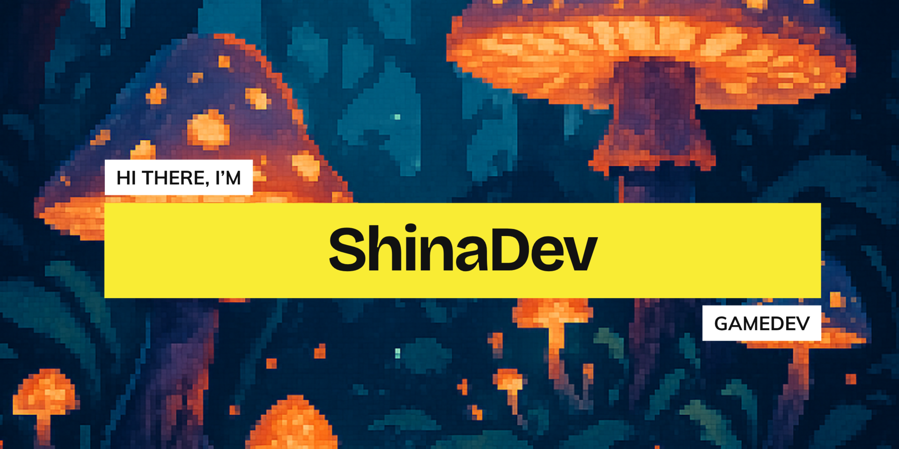

<div align="center">



# 👋 Hi, I'm Selene Contigiani

### Junior Unity Developer | C# | Mobile Games | Gameplay Systems

[](https://www.linkedin.com/in/selene-berenice-contigiani/)
[](mailto:selenecontigiani@gmail.com)
[](https://github.com/Shina-Dev?tab=repositories)

</div>

---

## 🎮 About Me

I'm a **Video Game Development and Virtual Simulations** student about to graduate, focused on building optimized and engaging gameplay systems in Unity.

```yaml
current_focus: "Thesis Project - 2D Mobile Game in Unity"
specialization: "Gameplay Programming"
interests: ["Game Systems", "Player Experience", "Code Architecture", "Optimization"]
learning: ["Advanced Unity Patterns", "Mobile Performance Optimization", "AI for Games"]
goal: "Build polished and scalable gameplay experiences"
```

### What I Bring

- Strong understanding of Unity lifecycle and component architecture  
- Clean and maintainable C# code  
- Gameplay system implementation (state logic, progression systems, combat mechanics)  
- Mobile-oriented development and UI adaptation  
- Focus on performance and structured code  

---

## 💻 Tech Stack

### Core
<div align="center">


</div>

### Familiar With
<div align="center">


</div>

---

## 🚀 Featured Projects

### 🏎️ FastTry
Endless mobile runner featuring dynamic difficulty, combat mechanics, and a slot-based upgrade system.

**Tech:** Unity, C#, Mobile Optimization  
🔗 https://github.com/Shina-Dev/Fasttry

---

### 🏉 Ruta Rugby
Rugby-themed mobile mini-game collection developed as a promotional tool for a local club.

**Tech:** Unity, C#, UI Systems  
🔗 https://github.com/Shina-Dev/Ruta-Rugby

---

## 📬 Contact

📧 selenecontigiani@gmail.com  
💼 https://www.linkedin.com/in/selene-berenice-contigiani/

---

<div align="center">

*"Great games are built where creativity meets clean architecture."*

</div>
